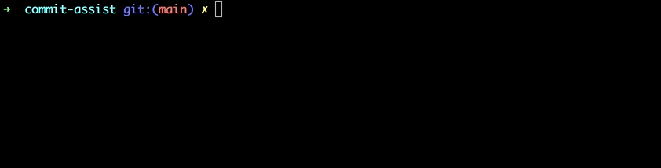

# CommitAssist

CLI tool that creates commit messages based on your diff.

## Installation

`yarn global add commit-assist`

## Usagee

Stage some files, then run `git-ca` from the command line. First time it will ask for your OpenAI API Key. Get yours [here](https://platform.openai.com/account/api-keys).
